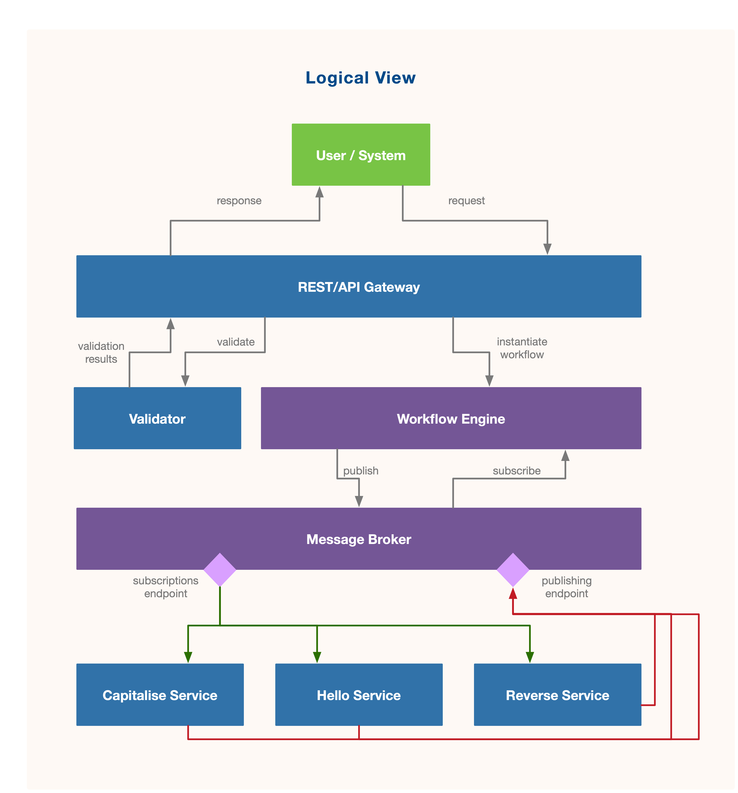
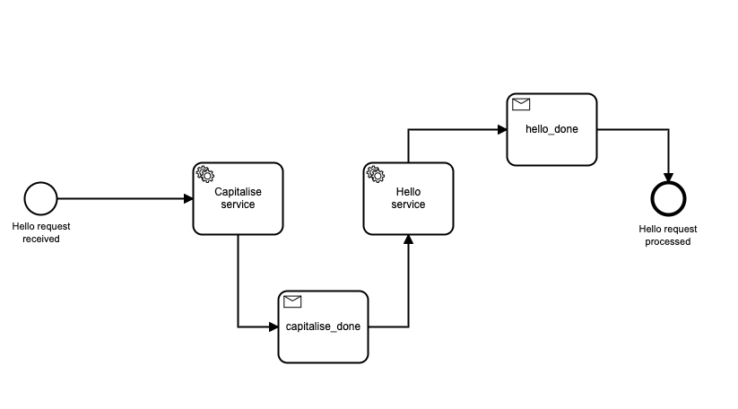
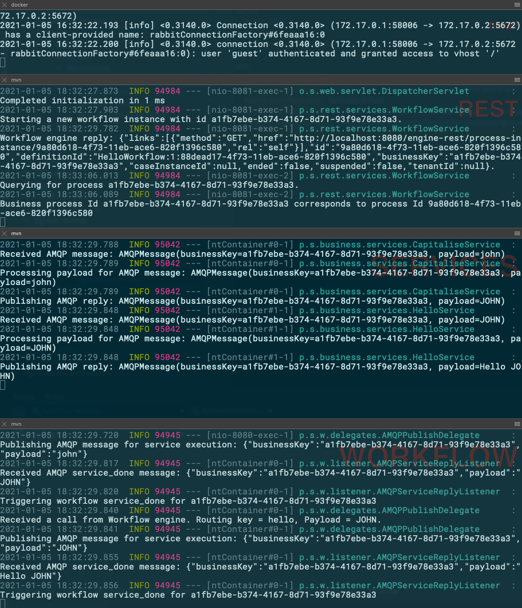

# Camnuda, AMQP, and Spring Boot microservices approach
This is a quick PoC demonstrating how to implement a microservices architecture in which business logic is driven by a BPM engine. (Micro)services are created in a Spring Boot app (bundled together for convenience) and communicate with AMQP. 

RabbitMQ has been used and as the AMQP broker and Camunda BPM as the workflow engine. 

## Architecture
The different modules of this PoC implement the following architecture:


## Workflow
The following simple workflow is being used:


An input is given to the workflow via the REST API of the PoC app, which is then passed through different services, first capitalising it and then add a "Hello" message. For example,
"John" becomes "Hello JOHN".

A third service is also available to reverse the payload which can be used to demonstrate how the business logic of the PoC can be changed without affecting the services deployed.

## Prerequisites
As microservices communication takes place using an AMQP broker, you need to have a RabbitMQ instance available. You can quickly fire up a Docker container with RabbitMQ with:

```docker
docker run --rm --hostname rabbitmq --name rabbitmq -p 5672:5672 rabbitmq
```

## Startup the PoC
All PoC apps are Spring Boot applications, so to run them you can execute the following steps in the root folder of each application:

```shell
mvn spring-boot:run
```

## Usage example
### Initiate a workflow
```shell
curl "http://localhost:8081/api/hello?name=john"
```

### Query the results of a workflow execution
Using the unique id provided as a result to the above call:
```shell
curl "http://localhost:8081/api/query?id=XYZ"
```

### Log output

